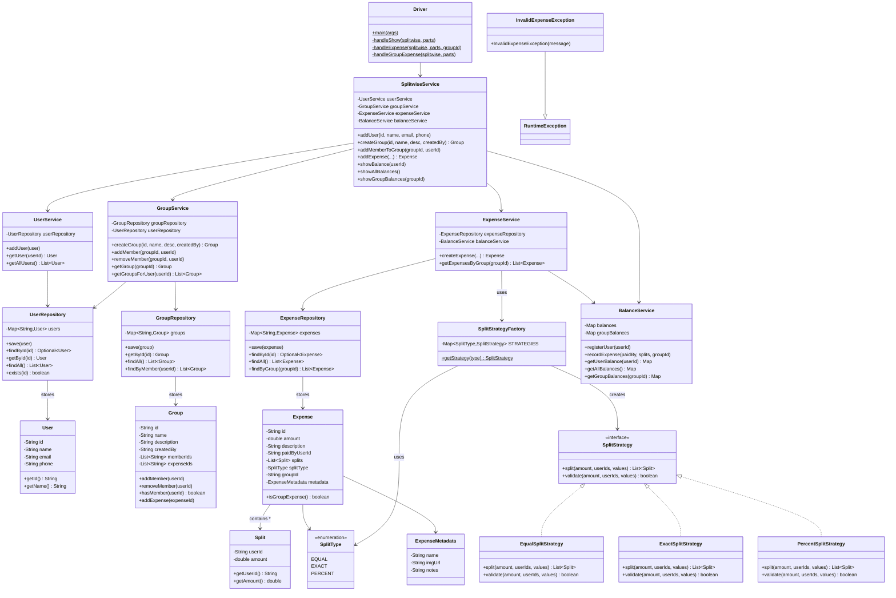
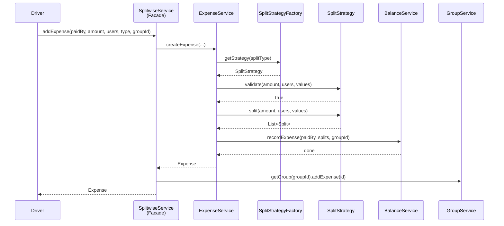

# Splitwise - Low Level Design

## Design Patterns Used

| Pattern | Where | Purpose |
|---------|-------|---------|
| **Strategy** | `SplitStrategy` + implementations | Interchangeable split algorithms (Equal, Exact, Percent) |
| **Factory** | `SplitStrategyFactory` | Creates the correct strategy based on `SplitType` |
| **Facade** | `SplitwiseService` | Single entry point hiding internal service complexity |
| **Repository** | `UserRepository`, `GroupRepository`, `ExpenseRepository` | Abstracts data access from business logic |
| **SRP** | Separate services | Each service handles one responsibility |

---

## Class Diagram



---

## Package Structure

```
SplitWiseMachineCoding/
├── model/
│   ├── User.java              # Immutable user entity
│   ├── Group.java             # Group with members & expenses
│   ├── Expense.java           # Immutable expense record
│   └── ExpenseMetadata.java   # Optional metadata
├── split/
│   ├── SplitType.java         # Enum: EQUAL, EXACT, PERCENT
│   └── Split.java             # Value object: userId + amount
├── strategy/
│   ├── SplitStrategy.java     # Strategy interface
│   ├── EqualSplitStrategy.java
│   ├── ExactSplitStrategy.java
│   ├── PercentSplitStrategy.java
│   └── SplitStrategyFactory.java
├── repository/
│   ├── UserRepository.java
│   ├── GroupRepository.java
│   └── ExpenseRepository.java
├── service/
│   ├── UserService.java       # User CRUD
│   ├── GroupService.java      # Group management
│   ├── ExpenseService.java    # Expense creation + validation
│   ├── BalanceService.java    # Balance sheet tracking
│   └── SplitwiseService.java  # Facade
├── exception/
│   └── InvalidExpenseException.java
└── Driver.java                # CLI entry point
```

---

## Supported Commands

| Command | Format | Example |
|---------|--------|---------|
| Show all balances | `SHOW` | `SHOW` |
| Show user balance | `SHOW userId` | `SHOW u1` |
| Add expense | `EXPENSE paidBy amount n u1..un type [values]` | `EXPENSE u1 1000 4 u1 u2 u3 u4 EQUAL` |
| Group expense | `GROUP_EXPENSE gId paidBy amount n u1..un type [values]` | `GROUP_EXPENSE g1 u1 600 3 u1 u2 u3 EQUAL` |
| Group balances | `GROUP_SHOW groupId` | `GROUP_SHOW g1` |
| Create group | `CREATE_GROUP groupId name createdBy` | `CREATE_GROUP g2 Office u1` |
| Add member | `ADD_MEMBER groupId userId` | `ADD_MEMBER g2 u3` |

---

## Flow Diagram


